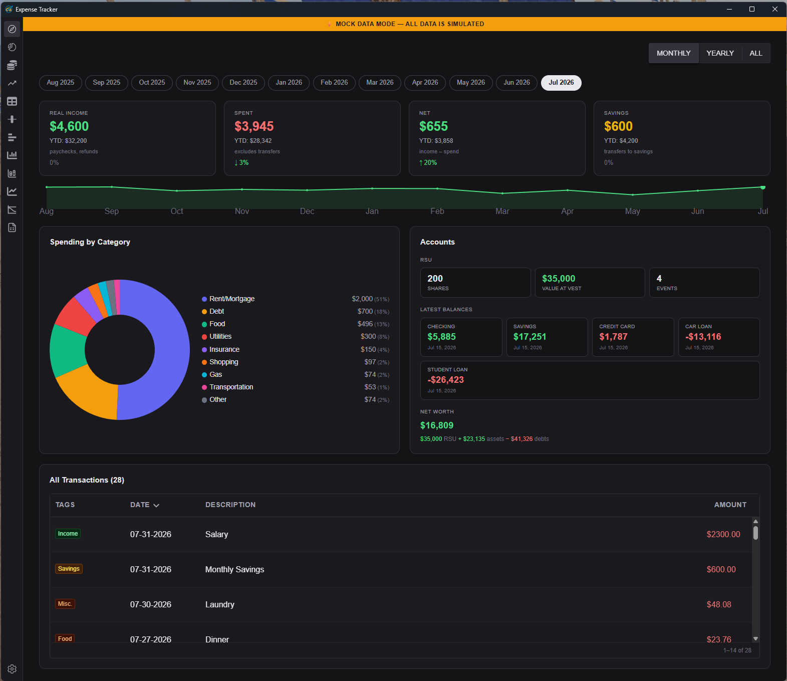

# Expense Tracker V2


Expense Tracker V2 is a desktop application for personal finance management, built with a Rust backend using Tauri and a React frontend. It provides robust tools for importing, visualizing, analyzing, and managing your financial data locally and securely.



## Features

- **Cross-Platform:** Runs on Windows, macOS, and Linux thanks to the Tauri framework.
- **CSV Import:** Easily import your transaction history from CSV files, including predefined formats for providers like Wells Fargo, American Express, and Capital One, with validation against those formats. Custom CSV definitions are supported.
- **Interactive Data Visualization (pure D3/SVG):** All charts are custom-built with D3.js and SVG — Plotly is not used.
  - **Overview Dashboard:** Summary cards for income, spending, net, and savings (each with previous-period and year-to-date deltas, plus a savings rate), a spending-by-tag donut, month navigation, a net-worth sparkline, and investment tracking.
  - **Grouped Bar Charts:** View aggregated expenses, income, and savings grouped by day, month, or year.
  - **Stacked Bar Charts:** Analyze spending distribution across tags, with a tags/groups toggle.
  - **Line Charts:** Track cumulative totals year-to-date.
  - **Sankey Diagram:** Visualize cash flow between income, spending, savings, and groups.
  - **Average Spending & Income vs. Expenses:** Compare spending and totals over selected periods.
  - **Hover tooltips** on every chart show label + value.
- **Dynamic Data Exploration:**
  - An interactive brush scrubber allows intuitive date-range selection and filtering across all views.
  - A date-picker modal provides precise range control.
  - **Double-click any chart bar/segment to drill into the Data Table**, pre-filtered to that category and period.
- **Comprehensive Expense Management:**
  - A searchable, filterable, and sortable data table displays all transactions with bulk edit/delete.
  - Full CRUD (Create, Read, Update, Delete) for expenses, plus bulk tagging and group assignment.
- **Customizable Tagging & Groups:** Categorize expenses with flexible tags and a second, orthogonal "group" dimension (e.g. a "Japan Trip"). A settings modal lets you toggle which tags and groups are included in charts and the overview.
- **Classified Transactions:** Entries are classified as Income, Savings, or Expense based on their group (with a legacy tag fallback), and flow through charts, reports, and the table accordingly.
- **Anomaly Detection:** A dedicated page flags a category's month when its total is far above that category's normal month (configurable multiplier + dollar threshold, compared against a trailing window). Double-click a flagged row to drill into the transactions.
- **Forecasting:** A cash-flow forecast page computes daily projected balances from income streams and expenses.
- **Accounts & RSU:** Track net worth via asset/debt balance snapshots, RSU grants and vesting, and sales.
- **SSDI Tracking:** Track SSDI income deposits against monthly SGA (substantial gainful activity) limits.
- **Mock Data Mode:** A settings toggle replaces all data with simulated sample data (with write-protection) for demos and screenshots.
- **Secure & Local:** All data is stored locally on your machine using `tauri-plugin-store`, ensuring your financial information remains private.
- **Multi-window Support:** Open multiple instances of the application to compare different views simultaneously.

## Anomaly Detection

The anomaly detection page compares each category's monthly spending against its own recent history:

- Spending is bucketed by month and by category (primary tag).
- For each month, the "typical" amount is the **median of the trailing N months** (default 12), so old historical norms don't skew current comparisons.
- A month is flagged when its total is more than **X times** normal, **or** more than **$Y over** normal.
- Both thresholds and the trailing window size are **user-configurable settings** that persist across restarts (Settings → Anomaly Detection).
- Double-clicking a flagged row filters the Data Table to that category within that month.

## Mock Data Mode

A global mock mode exists for screenshots and demos. When enabled via Settings, **all data** is replaced with fake data at the lowest possible layer — no page or hook is mock-aware. All setters are write-protected (nothing is persisted) while mock mode is on, and a yellow banner indicates the simulated state.

## Tech Stack

- **Backend:** Rust, Tauri
- **Frontend:** React 19, TypeScript, Vite
- **UI & Styling:** Chakra UI v3, Sass modules (`scss`)
- **State Management:** RxJS (BehaviorSubjects), Custom React Hooks
- **Charting:** D3.js with custom SVG renders (no Plotly)
- **Routing:** React Router v7

## Project Structure

The repository is a monorepo containing both the frontend and backend code:

- `src/`: The React/TypeScript frontend application. Includes all pages, components, charts, hooks, and state management logic.
- `src-tauri/`: The Rust backend. Handles core application logic, including:
  - Data persistence via `tauri-plugin-store`.
  - CSV file parsing and validation.
  - A command-based API exposed to the frontend.
  - Window and application lifecycle management.

## Getting Started

### Prerequisites

- **Rust:** Install via [rustup](https://rustup.rs/).
- **Node.js:** Install Node.js and `npm`.
- **Tauri CLI:** Install the command-line interface for Tauri.
  ```shell
  cargo install tauri-cli
  ```

### Installation & Setup

1.  Clone the repository:

    ```shell
    git clone https://github.com/nikcich/ExpenseTrackerV2.git
    cd ExpenseTrackerV2
    ```

2.  Install the frontend dependencies:

    ```shell
    npm install
    ```

3.  Build the Rust backend for the first time:
    ```shell
    cd src-tauri
    cargo build
    cd ..
    ```

## Usage

### Development

To run the application in development mode with hot-reloading for both the frontend and backend:

```shell
npm run tauri dev
```

### Building for Production

To build a distributable, production-ready executable for your platform:

```shell
npm run tauri build
```
